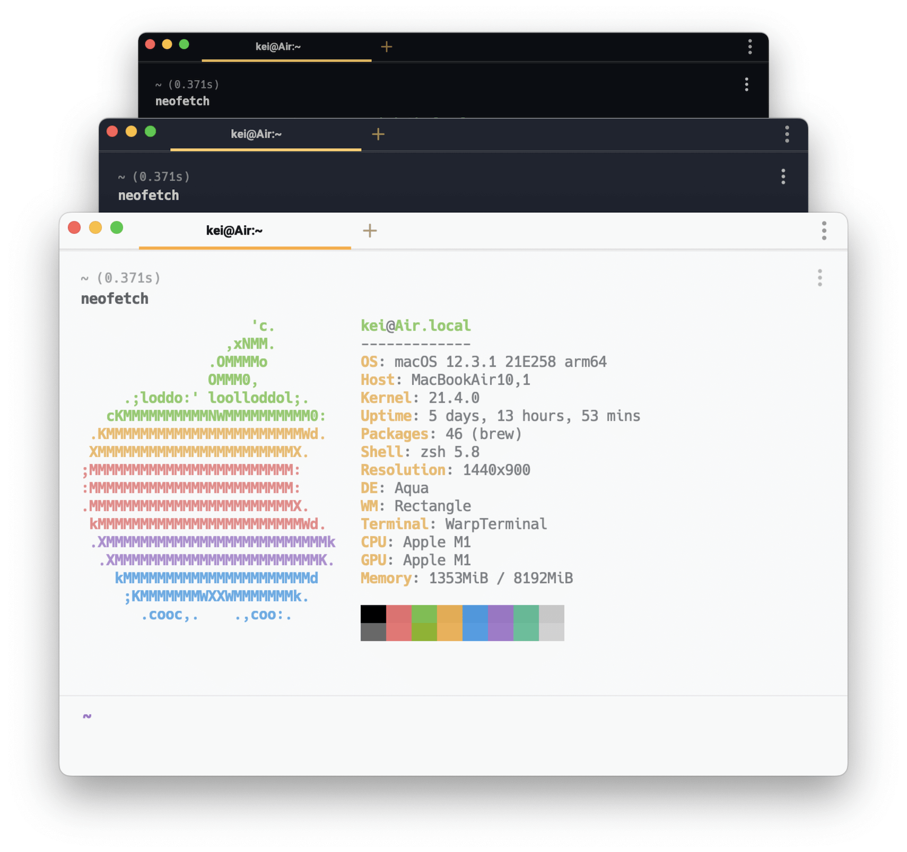
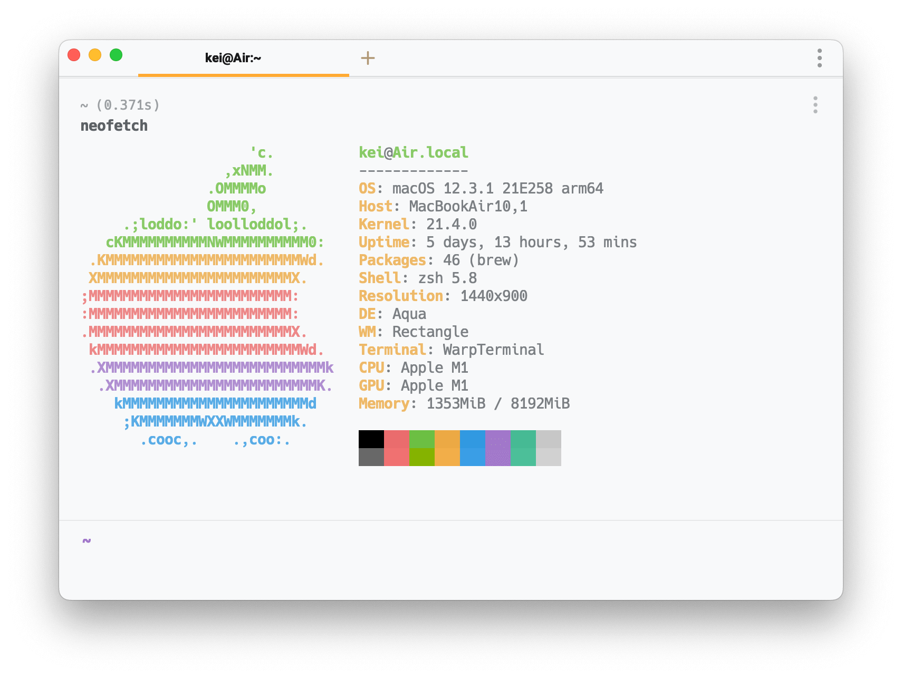
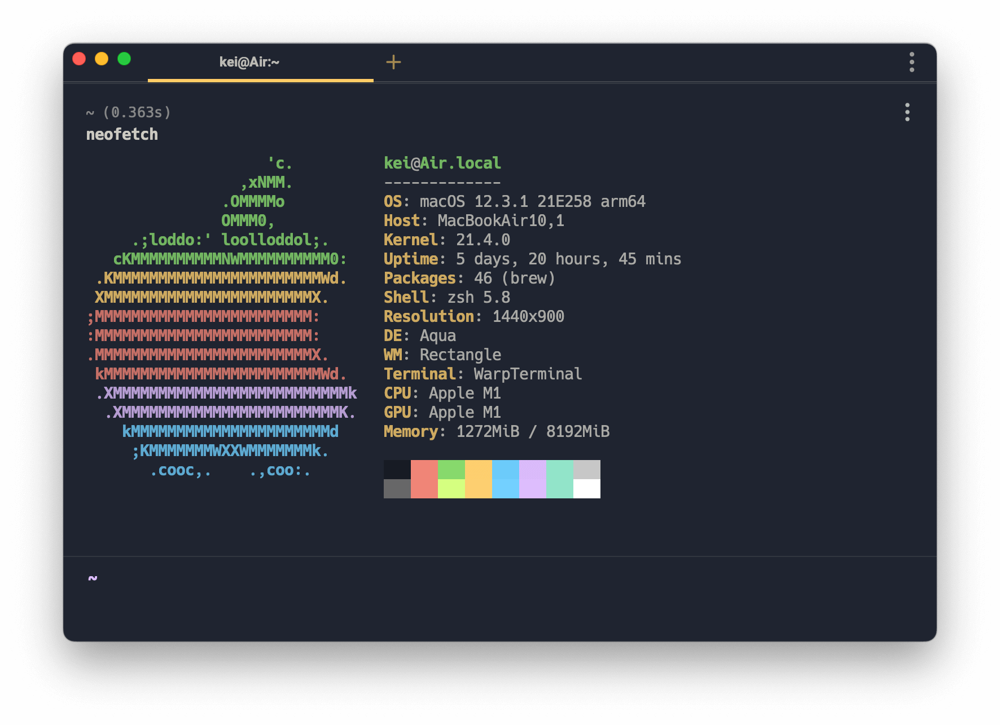
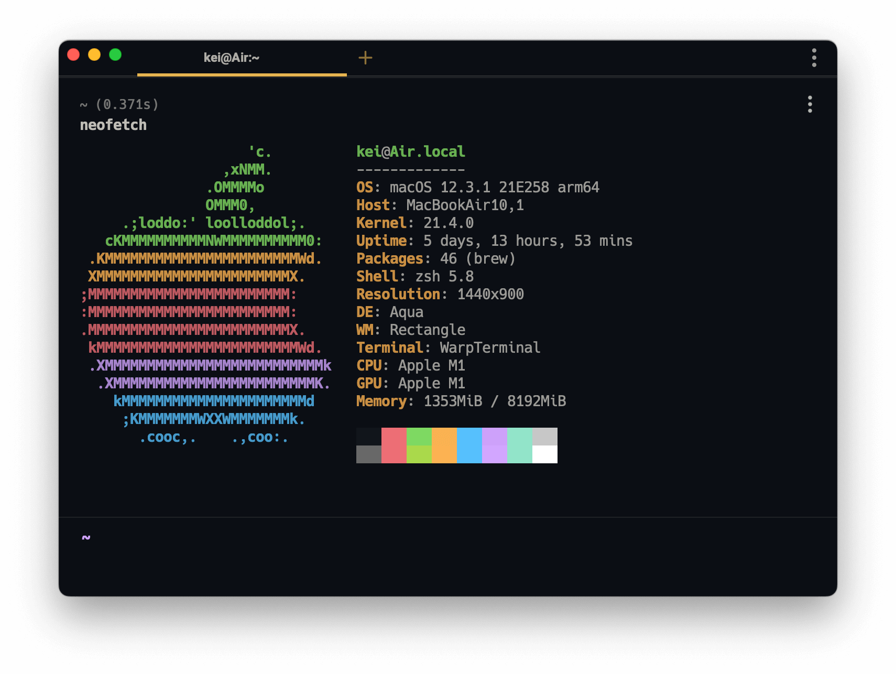

# ayu-warp

[ayu](https://github.com/dempfi/ayu) theme for [Warp](https://github.com/warpdotdev/Warp)

> `ayu` is a simple theme with bright colors and comes in three versions — _dark_, _mirage_ and _light_ for all day long comfortable work.



_All screenshots use default [Hack](https://sourcefoundry.org/hack) font._

## Install

- Create a config directory `~/.warp/themes` in your home directory.
- Download the theme files in the [themes](https://github.com/wkei/ayu-warp/tree/main/themes) directory from GitHub and copy them to `~/.warp/themes`.
- Change the theme in `Settings > Appearance` (`⌘+,`).

Reference: [https://docs.warp.dev/features/themes](https://docs.warp.dev/features/themes#1.-how-do-i-use-a-custom-theme-in-warp)

### CLI

```
mkdir -p ~/.warp/themes && cd "$_"
curl -O "https://github.com/wkei/ayu-warp/tree/main/themes/ayu_{light,mirage,dark}.yaml"
```

## Screenshots

#### Light



#### Mirage



#### Dark




